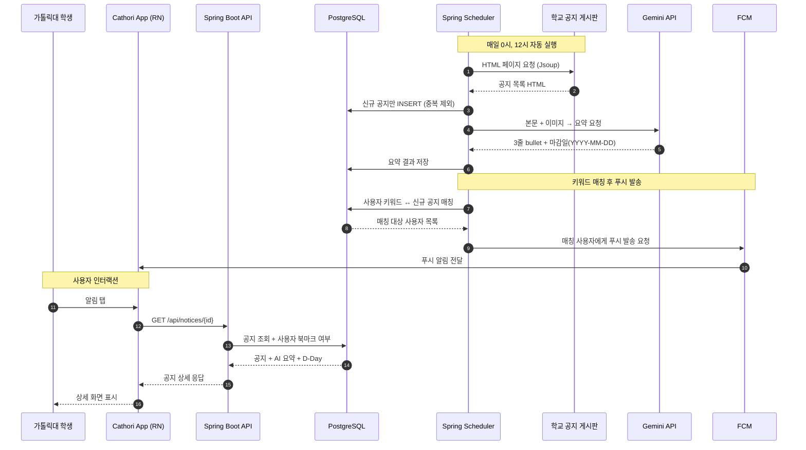
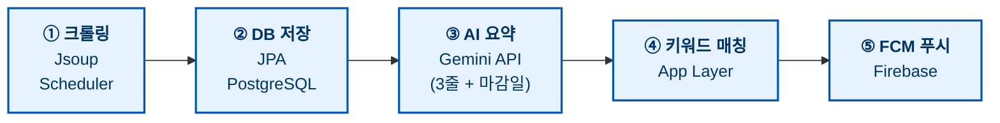

# Cathori 🔔

<!-- ============================================== --> <!-- 📌 비고: 여기에 Cathori 배너 이미지 추가 예정 --> <!-- 권장 크기: 1200 x 400 / DCU Blue + Ginkgo Yellow --> <!-- ============================================== --> <div align="center">


<h3>관심 공지를 편하게, 놓치지 않고 알람으로</h3> <p>가톨릭대학교 학생을 위한 공지 개인화 알림 서비스</p> <br/>

<a href="#">🚀 서비스 바로가기 (Play Store 심사 중)</a> | <a href="https://github.com/tomass22/Cathori/wiki">📚 팀 Wiki</a>

<br/>

   </div>

---

## 💡 이런 경험, 한 번쯤 있지 않으셨나요?

> "등록금 1차 납부 기간이 끝났다고요…? 저는 처음 듣는데요…"

- 📅 **등록금 납부 기한**을 놓쳐서 1차가 아닌 **2차에 납부**한 경험
- 🎯 가고 싶었던 **비교과 프로그램**의 신청이 이미 마감된 후에 공지를 본 경험
- 🏫 학교 공식 홈페이지, **트리니티 포털**, 학과 홈페이지를 **따로따로** 확인해야 하는 번거로움
- 💬 학내 공지를 일부 보내주던 **가대톡 서비스가 종료**된 이후, 이제는 직접 모든 공지를 직접 모니터링해야 하는 부담

저희도 같은 경험을 했고, 그래서 이 프로젝트를 시작했습니다.

---

## ✨ Cathori가 제안하는 해결책

|**🎯 관심사 기반 매칭**|**🤖 AI 본문 요약**|**🔔 실시간 푸시 알림**|
|---|---|---|
|학과·키워드를 미리 등록해두면 관련 공지만 골라 전달|AI가 본문과 이미지를 3줄로 요약하고 마감일 자동 추출|매칭된 공지가 올라오는 즉시 FCM으로 푸시 알림 발송|

> 💡 **Cathori는** _Catholic_ + 한국어 *소리(sori)*의 합성어로, "가톨릭대학교의 소식을 전하는 목소리"라는 뜻을 담고 있습니다.

---

## 🎬 주요 기능 (1차 MVP - 1.0.0 기준)

<!-- ============================================== --> 
<!-- 📌 비고: 각 기능별 스크린샷/GIF 추후 추가 예정 --> 
<!-- 권장 형식: Android 디바이스 프레임 + GIF/PNG --> 
<!-- ============================================== --> 

<h3 align="center">🔐 1. 인증 및 시작</h3>
<table align="center">
  <tr align="center" valign="top">
    <td width="50%">
      <h4>📝 로그인</h4>
      
      <p><small>회원가입 한 경우 로그인 하는 첫 시작 화면</small></p>
    </td>
    <td width="50%">
      <h4>📝 이메일 인증 회원가입</h4>
      
      <p><small>가톨릭대학교 학생임을 이메일 인증으로 확인 후 가입</small></p>
    </td>
  </tr>
</table>

<br/>

<h3 align="center">📢 2. 메인 피드 및 공지 조회</h3>
<table align="center">
  <tr align="center" valign="top">
    <td width="50%">
      <h4>🏠 메인 피드 · 필터</h4>
      
      <p><small>대분류(일반·장학·학사·취창업) + 사용자 태그 필터로 공지 골라 보기</small></p>
    </td>
    <td width="50%">
      <h4>📄 공지 AI 3줄 요약</h4>
      
      <p><small>Gemini API가 본문·이미지를 분석해 핵심 3줄과 마감일을 자동 정리</small></p>
    </td>
  </tr>
</table>

<br/>

<h3 align="center">🔍 3. 검색 및 맞춤 알림</h3>
<table align="center">
  <tr align="center" valign="top">
    <td width="33%">
      <h4>🔍 키워드 검색</h4>
      
      <p><small>300ms debounce 검색 + 최근 검색어 자동 저장</small></p>
    </td>
    <td width="33%">
      <h4>⚙️ 키워드 · 알림 설정</h4>
      
      <p><small>최대 20개 키워드 관리 · 알림 시간대 · 야간 알림 제한</small></p>
    </td>
    <td width="34%">
      <h4>🔔 푸시 알림 리스트</h4>
      
      <p><small>설정한 키워드 매칭 시 즉시 알림 및 리스트 적재</small></p>
    </td>
  </tr>
</table>

---

## 🔄 어떻게 동작하나요?

<details> 
<summary><h3>📊 전체 데이터 흐름</h3></summary>



</details>

<details> 
<summary><h3>🏗 처리 파이프라인 (5단계)</h3></summary>



</details>

> 💡 더 자세한 아키텍처, ERD, ADR(아키텍처 결정 기록)은 [Wiki](https://github.com/tomass22/Cathori/wiki)에서 확인할 수 있습니다.

---

## 🏛 시스템 아키텍처

<!-- ============================================== --> 
<!-- 📌 비고: 시스템 아키텍처 다이어그램 추가 예정 --> 
<!-- (NCP Cloud + Docker + 외부 API 연계 다이어그램) --> <!-- ============================================== -->

추후 이미지 추가 예정

## 🗂 프로젝트 구조

<details>
<summary><h3>프로젝트 설계 구조</h3></summary>

```
cathori/
├── frontend/                    # React Native + Expo
│   └── src/
│       ├── app/                 # Expo Router 스크린
│       │   ├── (tabs)/          # 하단 탭 (홈, 검색, 마이)
│       │   ├── notice/[id].tsx  # 공지 상세
│       │   └── auth/            # 로그인/회원가입
│       ├── features/            # 도메인 모듈
│       │   ├── notices/         # 공지 도메인
│       │   ├── search/          # 검색 도메인
│       │   └── auth/            # 인증 도메인
│       ├── shared/              # 공용 컴포넌트/훅/유틸
│       ├── services/            # Axios 인스턴스
│       ├── store/               # Zustand 스토어
│       └── constants/           # 디자인 토큰
│
├── backend/                     # Spring Boot
│   └── src/main/java/com/cathori/
│       ├── auth/                # 인증 (회원가입, 로그인, JWT)
│       ├── notice/              # 공지 도메인
│       ├── crawler/             # 크롤러 (Jsoup + Scheduler)
│       ├── summary/             # AI 요약 (Gemini)
│       ├── keyword/             # 키워드 관리
│       ├── bookmark/            # 즐겨찾기
│       ├── notification/        # FCM 푸시 (포트만 정의)
│       └── common/              # 공용 (예외, 설정, 보안)
│
├── docs/                        # 문서 (ADR, ERD, API 명세)
└── docker-compose.yml           # 로컬 개발 환경
```

</details>

<details>
<summary><h3>주요 엔티티</h3></summary>

```
users
  └─ id, email, student_id, department, created_at

keywords
  └─ id, user_id (FK), keyword, category

notices
  └─ id, source_url, title, content, category,
     ai_summary, deadline_at, published_at, crawled_at

bookmarks
  └─ id, user_id (FK), notice_id (FK), created_at

user_push_tokens
  └─ id, user_id (FK), fcm_token, platform, updated_at

notification_logs
  └─ id, user_id (FK), notice_id (FK), sent_at, clicked_at
```
	
</details>

---

## 🛠 기술 스택

<div align="center">

### Frontend (Mobile App)

 
 
 
 
 
 


### Backend

 
 
 
 
 
 


### Database


### AI / Notification

 


### Infra / DevOps

 
 
 


</div>

### 🎯 기술 선택 배경

|**결정**|**선택 이유**|
|---|---|
|**백엔드 언어**<br>Java / Spring Boot|팀 전원 공통 경험, 한국 취업 시장 적합성|
|**모바일 프레임워크**<br>>React Native + Expo|크로스플랫폼 + 빠른 빌드/배포 사이클|
|**DB**<br>PostgreSQL|벡터 임베딩 확장(pgvector) 지원, 무료, 풍부한 한국어 레퍼런스|
|**크롤링**<br>Jsoup (정적)|Spring과 동일 JVM, 학교 공지 페이지가 대부분 정적 HTML|
|**AI 요약**<br>Gemini 2.5 Flash-Lite|한국어 품질 양호 + 무료 티어 + 이미지 멀티모달 지원|
|**서버 호스팅**<br>NCP Cloud|캡스톤 지원 예산이 프리페이드 결제만 가능, 세금계산서 발행 지원|
|**상태 관리**<br>Zustand|Redux 대비 보일러플레이트 최소화, RN과 궁합 양호|

---

---

## 👥 팀 소개 · 회광반조

> **회광반조(回光返照)** — "빛이 거꾸로 돌아 비춘다"는 뜻으로, 해가 지기 직전 마지막으로 빛을 강하게 내뿜어 하늘을 밝게 비추는 자연현상을 가리킵니다. 막학년을 불태워서 학생들을 위한 서비스를 만들겠다는 다짐을 담았습니다.

<div align="center">
  <table>
    <tr>
      <!-- 팀원 1: 이정훈 -->
      <td align="center" width="160">
		    <br/>
		    <a href="https://github.com/tomass22" target="_blank" style="text-decoration: none; color: inherit;"><b>이정훈</b></a><br/>
		    <sub>Team Lead</sub><br/>
		    기획 · 앱
	    </td>
      <!-- 팀원 2: 이기백 -->
      <td align="center" width="160">
		    <br/>
		    <a href="https://github.com/NiceLeeMan" target="_blank" style="text-decoration: none; color: inherit;"><b>이기백</b></a><br/>
		    <sub>Backend Lead</sub><br/>
        서버
      </td>
      <!-- 팀원 3: 김재민 -->
      <td align="center" width="160">
		    <br/>
		    <a href="https://github.com/leasenose" target="_blank" style="text-decoration: none; color: inherit;"><b>김재민</b></a><br/>
		    <sub>Backend</sub><br/>
        서버
      </td>
    </tr>
  </table>
</div>

<!-- ============================================== --> 
<!-- 📌 비고: 각 팀원의 GitHub 링크와 프로필 이미지 --> 
<!-- 실제 GitHub 계정으로 교체 예정 --> 
<!-- ============================================== -->

---

## 🏫 프로젝트 정보

- **소속**: 가톨릭대학교 (Catholic University of Korea)
- **과목**: 종합설계프로젝트 (캡스톤 디자인)
- **진행 기간**: 2026.03 ~ 2026.06
- **타겟 사용자**: 가톨릭대학교 학부생
- **첫 출시 플랫폼**: Android (Google Play Store, 추후 등록)

---

## 📄 라이선스

'Copyright (c) 2026 Lee Jung-hoon. All rights reserved.'

본 프로젝트의 코드는 Public으로 공개되어 누구나 자유롭게 열람하고 참고할 수 있습니다.
다만, 본 코드를 기반으로 수정, 변경, 또는 추가 개발(디벨롭)을 하여 배포 및 사용할 경우, Repo의 멤버가 아니라면 반드시 프로젝트 팀장(이정훈/tomass22)의 사전 서면 허락을 받아야 합니다. 
(상업적 이용이 아닐지라도 허락이 필요합니다. 단, 허락에 따른 비용은 요구하지 않습니다.)

문의: dominanthat@gmail.com

---

## 💌 문의 / 피드백

서비스 사용 중 불편한 점이나 제안하고 싶은 기능이 있다면 언제든 알려주세요.

- **이메일**: dominanthat@gmail.com
- **사용자 피드백 폼**: 출시 후 앱 내 설정 화면에서 제공 예정

<br/> 

<div align="center">

**Cathori는 가톨릭대학교 학생을 위해, 가톨릭대학교 학생이 만들고 있습니다.** 🐦

⭐ 응원해주신다면 Star 한 번 부탁드립니다!

</div>
